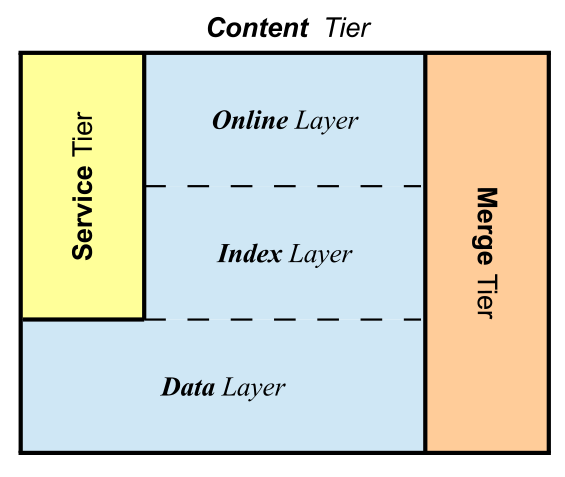

## Dashcam Project

The project shows a demo on a screen such that people can analyse its benefits and thereby, customize their experience. The `work`, `holiday` and `home` modes contain exhaustive and mutually inclusive events that takes into consideration the project objectives.

### Automatic License Plate Recognition

License Plate is encoded information required by law for all vehicles to display on the front and back side of the car. US license plates are designed by their states, they also differ by their character length. UK license plates are designed by their counties and model date. Since the license plates form a template, it is efefctive for us to create an index of plates which can be used to identify the origin of the car dealer, manufacturer or ownership. 

Here's a small script that does the work of indexing the plates in the UK. 

When you execute the script provided:

> cd scripts/ && python lpr.py 

you get the result:

('BD', '17', 'ABC')

The first tag is a DVLA memory tag
The second is the age of the car
The third is the random characters assigned to the registered vehicle

An example of the license plate recognition task has been provided below

How to execute the App
----------------------

## Unix / Linux

./run_project.sh

# SOLID Architecture

The dashcam project is organised into: 

## **S**ervice              The layer that communicates with Online and Index
## **O**n**L**ine           The layer that performs real time processing of data
## **I**ndex                The layer that enables batch processing or queries on the data
## **D**ata                 The layer that enables persistence of raw data

SOLID Architecture for Real-time data. This is with reference to the paper cited at [The Solid architecture for real-time management of big semantic data](https://www.sciencedirect.com/science/article/abs/pii/S0167739X1400209X). All data requests that are sent to the dashcam which uses the Index and Online Layers are grouped into Service Layers. The Merge layer for all the SOLID layers has been exposed as a Python executable. The docker environment provides access to all of the dashcam functionality. 



## Data Layer

`assets/vehicle-measures.csv` file contains min height and max height of lower end and higher end vehicles from which the approximate distance to the vehicle can be detected. 

The data layer contains QGIS (Geographical Information System) data which contains landmark information in a journey presented to the passengers as voice assists.

## Online Layer

Home, Holiday and Work modes are processed using OpenVX graph API. They produce gaussian filters of the video. 

## Service Layer

`Service/SpatialInformation.py` file gets a Homographic projection of an Image region. If a banner or poster needs to be identified, the dashcam shows them within their journey information.

`Service/LicensePlateIdentifier.py` file extracts the plate information fro m ALPR inference. This is country specific and refers to the Index layer for extracting LicensePlate attributes such as region, age of the license plate. 

`Service/GStreamer.py` and `Service/TextToSpeech.py` converts any text to be displayed to the passengers into voice assists. 

The GIS Service Layer also contains an MQTT service which delivers the usable information about any activity engaging the passengers during the journey.

## Index Layer

ALPR uses character detection region based models and metadata models in the `runtime_data/region` and `runtime_data/config` directories respectively. 

Text detection uses Extremal Regions to extract text regions from the Gaussian Filters. 

The Index layer contains a metadata index about journey information obtained from the GIS service layer.

### Text Detection on Dashcam Video

Using Extremal Region Filter for the 2nd stage classifier of N&M algorithm Neumann L., Matas J., `Text/libmain.cpp` infers bounding boxes from the gaussian filter applied to the video. 

An example of text detection has been provided here:


## OpenALPR

OpenALPR is a popular license plate recogntion toolkit which can look for recognizable license plates while driving and on recording mode of the dashcam. 

## Pre-built librraies included

### OpenCV

The project contains pre-built OpenCV library.

### OpenVX

The project contains pre-built OpenVX library.

## Results

### Running OpenVX using Gaussian Filter

```bash
cd Video/ && mkdir build && cmake .. && make all && cd home
./home $INPUT_VIDEO $OUPUT_VIDEO $FPS $STRIDE
```

### Running Text/ALPR detection with Boost Python

```bash
cd Text/
python2.7 setup.py build_exit -i
```

```c++

#include <iostream>
#include <stdio.h>
#include <string>
#include <vector>
#include "alpr.h"
#include "alpr_c.h"
#include <opencv2/opencv.hpp>
#include <opencv2/imgcodecs.hpp>
#include <opencv2/videoio/videoio_c.h>
#include <opencv2/imgproc/imgproc_c.h>

#include <boost/python.hpp>
#include <boost/filesystem.hpp>
#include <boost/python/numpy.hpp>
#include <boost/python/object.hpp>
#include <boost/python/module.hpp>
#include <boost/python/def.hpp>
#include <boost/python/detail/defaults_gen.hpp>
#include <boost/python/raw_function.hpp>
#include <boost/python/suite/indexing/vector_indexing_suite.hpp>
#include <numpy/arrayobject.h>
#include <sstream>

using namespace boost::filesystem;

using namespace alpr;
namespace bp = boost::python;
namespace np = boost::python::numpy;

#define LIB_ALPR_VERSION "0.0.1"

namespace Dashcam {

class ALPRImageDetect {

public:

    struct LicensePlate {
        std::string plateText;
        int index;
        float confidence;
        bool match;
    };

    const std::string extension = ".jpg";
    static constexpr float OVERALL_CONFIDENCE = 0.5f;

    ALPRImageDetect() {}
    ~ALPRImageDetect() {}

    void setAttributes(std::string i_config, std::string i_country, std::string i_region = "", std::string runtime_dir = "")
    {
        configFileName = i_config;
        country = i_country;
        region = i_region;

        setInstance(runtime_dir);
    }

    void setInstance(std::string runtime_dir)
    {
        instance = new alpr::Alpr(country, configFileName, runtime_dir);
    }

    void setFrame(np::ndarray src)
    {
        np::ndarray nd = np::array(src);
        rows = (int) nd.shape(0);
        cols = (int) nd.shape(1);

        char * data = nd.get_data();
        cv::Mat i_image(rows,cols,CV_8UC3,data,cv::Mat::AUTO_STEP);

        image = i_image.clone();
    }

    void setImage(char * data, int r, int c)
    {
        rows = r;
        cols = c;
        cv::Mat i_image(r, c, CV_8UC3, data, cv::Mat::AUTO_STEP);
        image = i_image.clone();
    }

    bp::object getPlacements()
    {
        return placements;
    }

    std::vector<AlprRegionOfInterest> constructRegionsOfInterest(std::vector<std::tuple<int, int, int, int>> regionsOfInterest)
    {
        int x, y, width, height;
        std::vector<AlprRegionOfInterest> regions(regionsOfInterest.size());
        for(int i = 0; i < regionsOfInterest.size(); i++) {
            std::tie(x, y, width, height) = regionsOfInterest[i];
            AlprRegionOfInterest regionOfInterest(x, y, width, height);
            regions[i] = regionOfInterest;
        }
        
        return regions;
    }

    std::vector<LicensePlate> processPlates(AlprResults results, float overall_confidence = ALPRImageDetect::OVERALL_CONFIDENCE, bool matches_template = false)
    {
        std::vector<LicensePlate> licensePlates;
        for (int i = 0; i < results.plates.size(); i++)
        {
            AlprPlateResult plate = results.plates[i];
            AlprRegionOfInterest _region = results.regionsOfInterest[i];
            for (int j = 0; j < plate.topNPlates.size(); j++)
            {
                AlprPlate candidate = plate.topNPlates[j];
                bool match = true ? (matches_template == false) : (candidate.matches_template == matches_template);
                if(candidate.overall_confidence > overall_confidence && match) {
                    licensePlates.push_back(LicensePlate{candidate.characters, i, candidate.overall_confidence, candidate.matches_template});
                }
            }
            placements.append(bp::make_tuple(
                bp::make_tuple(results.epoch_time,results.frame_number,results.img_width,results.total_processing_time_ms), 
                bp::make_tuple(_region.x,_region.y,_region.width,_region.height)));
        }

        return licensePlates;
    }

    AlprResults detectAutonomousLicensePlate(int topN, std::vector<std::tuple<int, int, int, int>> regionsOfInterest)
    {
        instance->setTopN(topN);
        cv::Size size = image.size();
        void* buffer = malloc(size.width*size.height*sizeof(int)*3);
        std::vector<uchar>* buf = reinterpret_cast<std::vector<uchar>*>(buffer);
        cv::imencode(extension, image, *buf, {cv::IMWRITE_JPEG_OPTIMIZE});
        std::vector<AlprRegionOfInterest> RegionsOfInterest = constructRegionsOfInterest(regionsOfInterest);
        std::vector<char>* charbuf = reinterpret_cast<std::vector<char>*>(buf);
        results = instance->recognize(*charbuf, RegionsOfInterest);
        return results;
    }

    std::vector<LicensePlate> detectLicensePlateMatches(int topN, std::vector<std::tuple<int, int, int, int>> regionsOfInterest, bool matches)
    {
        results = detectAutonomousLicensePlate(topN, regionsOfInterest);

        return processPlates(results, 0.5f, matches);
    }

    bp::list LicensePlate_Matches(int topN, bp::list regions_of_interest, bool matches = false)
    {
        std::vector<std::tuple<int, int, int, int>> regionsOfInterest(bp::len(regions_of_interest));
        std::vector<LicensePlate> results;

        int i = 0, a1,a2,a3,a4;
        bp::ssize_t n = bp::len(regions_of_interest);
        for(bp::ssize_t i = 0; i < n; i++) {
            bp::object elem = regions_of_interest[i];
            a1 = bp::extract<int>(elem[0]);
            a2 = bp::extract<int>(elem[1]);
            a3 = bp::extract<int>(elem[2]);
            a4 = bp::extract<int>(elem[3]);
            regionsOfInterest[i] = std::make_tuple(a1,a2,a3,a4);
        }

        results = detectLicensePlateMatches(topN, regionsOfInterest, matches);

        bp::tuple plate;
        bp::list plates;
        for(int j = 0; j < results.size(); j++) {
            plate = bp::make_tuple(results[j].plateText, results[j].confidence, results[j].match);
            plates.append(plate);
        }

        return plates;
    }

private:
    cv::Mat image;
    int rows;
    int cols;
    std::string configFileName;
    std::string country;
    std::string region;
    alpr::Alpr* instance;
    alpr::AlprResults results;
    bp::list placements;
};

}

BOOST_PYTHON_MODULE(libalpr) {

  Py_Initialize();
  np::initialize();

  using namespace boost::python;
  using namespace Dashcam;

  bp::class_<ALPRImageDetect>("ALPRImageDetect")
      .def(bp::init<>())
      .def("Attributes", &ALPRImageDetect::setAttributes)
      .def("Placements", &ALPRImageDetect::getPlacements)
      .def("SetFrame", &ALPRImageDetect::setFrame)
      .def("LicensePlate_Matches", &ALPRImageDetect::LicensePlate_Matches);

  import_array1();

}

```

```python

from ALPR import libalpr

alpr = lib_alpr.ALPRImageDetect()

alpr.Attributes(os.path.abspath("./ALPR/alpr_config/runtime_data/gb.conf"), 
"eu", "", os.path.abspath("./ALPR/alpr_config/runtime_data"))

```

```bash
cd ALPR/
python2.7 setup.py build_exit -i
```

```python

from Text import libmain

txt.Initialize(frame, 
"/home/dashcam/Text/trained_classifierNM1.xml", 
"/home/dashcam/Text/trained_classifierNM2.xml")
txt.Run_Filters()
image = txt.Groups_Draw(np.zeros_like(frame))

```

```c++

// Produce deprecation warnings (needs to come before arrayobject.h inclusion).
#define NPY_NO_DEPRECATED_API NPY_1_7_API_VERSION

#define TXT_DECODE_VERSION "0.0.1"

#include "Python.h"  // NOLINT(build/include_alpha)

#include <vector>
#include <iostream>
#include <iomanip>
#include <string>  // NOLINT(build/include_order)
#include <vector>  // NOLINT(build/include_order)
#include <fstream>  // NOLINT
#include <iostream>
#include <stdio.h>
#include <sstream>
#include <string>
#include <iostream>     // std::cout
#include <functional>

#include <boost/python.hpp>
#include <boost/python/numpy.hpp>
#include <boost/python/object.hpp>
#include <boost/python/module.hpp>
#include <boost/python/def.hpp>
#include <boost/python/detail/defaults_gen.hpp>
#include <boost/python/raw_function.hpp>
#include <boost/python/suite/indexing/vector_indexing_suite.hpp>
#include <numpy/arrayobject.h>
#include <numpy/ndarrayobject.h>

#include "opencv2/opencv.hpp"
#include "opencv2/core.hpp"
#include "opencv2/core/cvstd.hpp"
#include "opencv2/core/types.hpp"
#include "opencv2/core/utility.hpp"
#include "opencv2/text.hpp"
#include <stdio.h>
#include <iostream>
#include <stdlib.h>
#include <opencv2/opencv.hpp>

#define STRINGIFY(m) #m
#define AS_STRING(m) STRINGIFY(m)

using namespace std;
using namespace cv;

namespace bp = boost::python;
namespace np = boost::python::numpy;

void groups_draw(cv::Mat &src, std::vector<cv::Rect> &groups)
{
    for (int i=(int)groups.size()-1; i>=0; i--)
    {
        if (src.type() == CV_8UC3)
            cv::rectangle(src,groups.at(i).tl(),groups.at(i).br(),Scalar( 0, 255, 255 ), 3, 8 );
        else
            cv::rectangle(src,groups.at(i).tl(),groups.at(i).br(),Scalar( 255 ), 3, 8 );
    }
}

namespace Dashcam {

class TextDetection 
{
public:
  TextDetection() {}
  ~TextDetection() {}

  void Initialize(np::ndarray src, std::string classifierNM1, std::string classifier_NM2)
  {
    np::ndarray nd = np::array(src);
    rows = (int) nd.shape(0);
    cols = (int) nd.shape(1);

    char * data = nd.get_data();
    cv::Mat i_image(rows,cols,CV_8UC3,data,cv::Mat::AUTO_STEP);

    image = i_image.clone();

    ChanneliseFilters(classifierNM1, classifier_NM2);
  }

  void setImage(char * data, int r, int c)
  {
      rows = r;
      cols = c;
      cv::Mat i_image(r, c, CV_8UC3, data, cv::Mat::AUTO_STEP);
      image = i_image.clone();
  }

  cv::Ptr<cv::text::ERFilter> getFilterStage1() {
    return filterStage1;
  }

  cv::Ptr<cv::text::ERFilter> getFilterStage2() {
    return filterStage2;
  }

  vector<cv::Mat> getChannels() {
    return channels;
  }

  PyObject* Get_Image(cv::Mat i_image) {

    //2D image with 3 channels.
    npy_intp dimensions[3] = {i_image.rows, i_image.cols, i_image.channels()};

    //image.dims = 2 for a 2D image, so add another dimension for channels.
    return PyArray_SimpleNewFromData(i_image.dims + 1, (npy_intp*)&dimensions, NPY_UINT8, i_image.data);
  }

  vector<cv::Mat> createChannels() {
    vector<cv::Mat> channels;
    cv::text::computeNMChannels(image, channels, cv::text::ERFILTER_NM_IHSGrad);
    cv::Mat expr;
    size_t length = channels.size();
    // preprocess channels to include black and the degree of hue factor
    for(size_t i = 0; i < length-1; i++) {
        expr = channels[i].mul(-1);
        cv::Mat full = cv::Mat::ones(channels[i].size(), channels[i].type()) * 255;
        channels.push_back(full + expr);
    }
    return channels;
  }

  virtual cv::Ptr<cv::text::ERFilter> obtainFilterStage1(const cv::String& filename, 
        int thresholdDelta = 16, float minArea = (float)0.00015,
        float maxArea = (float)0.13, float minProbability = (float)0.2, 
        bool nonMaxSuppression = true, float minProbabilityDiff = (float)0.1) {
    cb1 = cv::text::loadClassifierNM1(filename);
    return cv::text::createERFilterNM1(cb1,thresholdDelta,minArea,maxArea,minProbability,nonMaxSuppression,minProbabilityDiff);
  }

  virtual cv::Ptr<cv::text::ERFilter> obtainFilterStage2(const cv::String& filename, float minProbability = (float)0.5) {
    cb2 = cv::text::loadClassifierNM2(filename);
    return cv::text::createERFilterNM2(cb2,minProbability);
  }

  void ChanneliseFilters(cv::String NM1_CLASSIFIER="./trained_classifierNM1.xml", 
  cv::String NM2_CLASSIFIER="./trained_classifierNM2.xml") {
    channels = createChannels();
    filterStage1 = obtainFilterStage1(NM1_CLASSIFIER);
    filterStage2 = obtainFilterStage2(NM2_CLASSIFIER);
  }

  int runFilter(vector<vector<cv::text::ERStat>> &regions) {
    for(int i = 0; i < channels.size(); i++) {
      filterStage1->run(channels[i], regions[i]);
      filterStage2->run(channels[i], regions[i]);
    }

    vector< vector<cv::Vec2i> > region_groups;
    vector<cv::Rect> groups_boxes;
    cv::text::erGrouping(image, channels, regions, region_groups, groups_boxes, cv::text::ERGROUPING_ORIENTATION_HORIZ);
    
    groups_rects.assign(groups_boxes.begin(), groups_boxes.end());

    // memory clean-up
    filterStage1.release();
    filterStage2.release();

    return 0;
  }

  void RunFilters(vector<cv::Mat> channels) {

    vector<vector<cv::text::ERStat>> regions(channels.size());
    runFilter(regions);

    regions.clear();
  }

  void Run_Filters()
  {
    vector<cv::Ptr<cv::text::ERFilter>> cb_vector { getFilterStage1(), getFilterStage2() };
    RunFilters(channels);
  }

  std::vector<std::tuple<int, int, int, int>> groupRects()
  {
    std::vector<std::tuple<int, int, int, int>> rects(groups_rects.size());
    for(int i = 0; i < groups_rects.size(); i++) {
      rects[i] = std::make_tuple(groups_rects[i].x, groups_rects[i].y, groups_rects[i].width, groups_rects[i].height);
    }
    return rects;
  }

  bp::list Groups_Rects()
  {
    bp::list rects;
    for(int i = 0; i < groups_rects.size(); i++) {
      rects.append(bp::make_tuple(groups_rects[i].x, groups_rects[i].y, groups_rects[i].width, groups_rects[i].height));
    }
    return rects;
  }

  PyObject* Groups_Draw(np::ndarray state)
  {
    np::ndarray nd = np::array(state);
    char * data = nd.get_data();
    cv::Mat state_image(rows, cols, CV_8UC3, data, cv::Mat::AUTO_STEP);

    groups_draw( state_image, groups_rects );

    return Get_Image( state_image );
  }

  private:
    cv::Mat image;
    cv::Ptr<cv::text::ERFilter> filterStage1;
    cv::Ptr<cv::text::ERFilter> filterStage2;
    cv::Ptr<cv::text::ERFilter::Callback> cb1;
    cv::Ptr<cv::text::ERFilter::Callback> cb2;
    vector<cv::Mat> channels;
    vector<cv::Rect> groups_rects;
    int rows;
    int cols;
};

}

#ifdef USE_BOOST_MODULE

BOOST_PYTHON_MODULE(libmain) {

  Py_Initialize();
  np::initialize();

  using namespace boost::python;

  bp::scope().attr("__version__") = AS_STRING(TXT_DECODE_VERSION);

  bp::class_<TextDetection>("TextDetection")
      .def("Initialize", &TextDetection::Initialize)
      .def("Run_Filters", &TextDetection::Run_Filters)
      .def("Groups_Rects", &TextDetection::Groups_Rects)
      .def("Groups_Draw", &TextDetection::Groups_Draw);

  import_array1();

}

#endif

```

## DashCam Executable

```bash
python3 dashcam.py --video 
```

The dashcam project is run on text, ALPR and Vehicle detection from a single video. This is done to compare the performance results between the mode of execution.

```bash
python3 dahcam_extended.py --video
```

In this mode, the dashcam project is run on all three using separate videos. The vehicle detection is run under gaussian filter produced by OpenVX graph.

```bash
python3 dashcam_openvino.py --video
```

In this mode, Two custom layers are created within vehicle detection (SSD) model. The outputs are run by Inference Engine and using TBB / OMP frameworks. The code for custom layers is in `src/`.


## Services available

### GStreamer

The gstreamer GSTParse is available as a C++ link below. GSTreamer has also got Python based interface which can be installed using `PyGObject`

### Spatial Information 

Based on the `assets/vehicle-measures.csv` file, an incremental update is done to lower end vehicles such as small cars and higher end vehicles and large vehicles. `xmin`, `xmax`, `ymin`, `ymax` are minimum and maximum heights of vehicles for each category respectively. This is named as `reference_intervals` for every service call to obtain Spatial Information.

### Image Segmentation

Image segmentation is done based on:

- `Region Growing`
- `Distance Transform`
- `Connected Components`
- `Markers Dilation`

Any detected text or vehicle or number plate that is in perspective view is warped using transform to show the end user in the demo video. 

## Warning System

The warning system implemented in the Dashcam is audio based for which we show a video reference. The audio based warning system uses `gTTS` framework which converts text to voice. 

